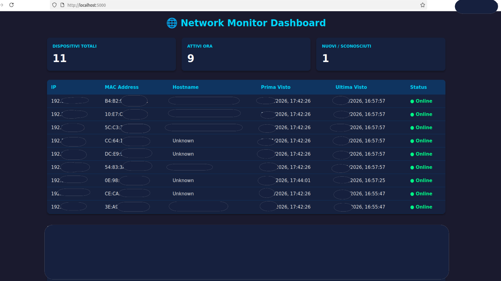
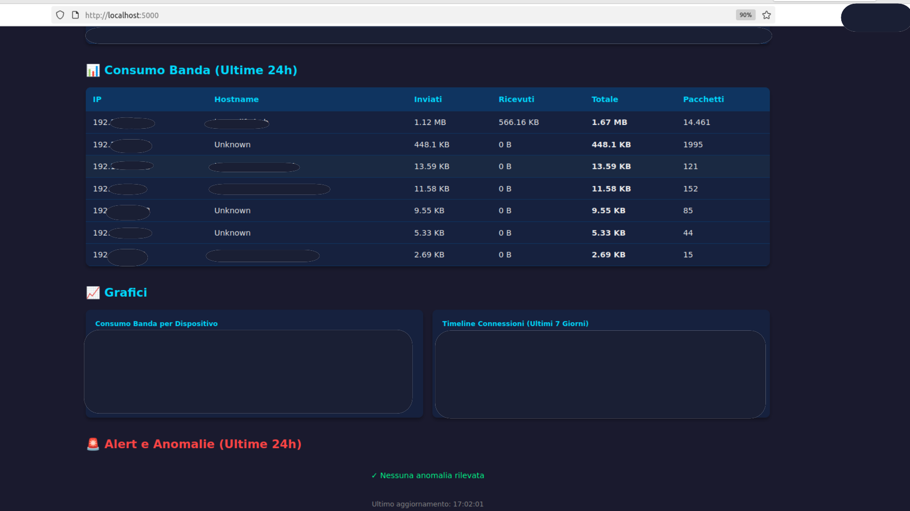

# 🌐 HomeNetMonitor


Real-time home network monitoring dashboard with device detection and anomaly alerts.

## 📋 Features

- ✅ Automatic network scanning every 30 seconds
- ✅ Device detection (IP, MAC, hostname)
- ✅ Real-time web dashboard with auto-refresh
- ✅ Visual alerts for new/unknown devices
- ✅ Connection history in SQLite database
- ✅ Online/offline device status
- ✅ **Bandwidth monitoring per device** (packet sniffing)
- ✅ **Anomaly detection** (high traffic, suspicious hours)
- ✅ **Chart.js graphs** (bandwidth usage + connection timeline)
- ✅ **7-day historical data visualization**

## 🛠️ Tech Stack

- **Backend**: Python 3.10+
- **Network Scanning**: nmap, python-nmap
- **Packet Sniffing**: scapy
- **Web Framework**: Flask
- **Database**: SQLite
- **Frontend**: HTML, CSS, JavaScript
- **Charts**: Chart.js

## 📦 Installation

### Prerequisites
```bash
sudo apt update
sudo apt install python3.10-venv nmap
```

### Setup
```bash
# Clone repository
git clone https://github.com/torchiachristian/HomeNetMonitor.git
cd HomeNetMonitor

# Create virtual environment
python3 -m venv venv
source venv/bin/activate

# Install dependencies
pip install -r requirements.txt

# Initialize database
python3 src/database.py
```

## 🚀 Usage

### 1. Start the network monitor
```bash
sudo venv/bin/python3 src/monitor.py
```

**Note**: Requires `sudo` for raw socket network scanning access.

### 2. Start the dashboard (in another terminal)
```bash
cd ~/HomeNetMonitor
source venv/bin/activate
python3 src/app.py
```

### 3. Access the dashboard

Open browser at: `http://localhost:5000`

## 📊 Dashboard

The dashboard displays:

- **Statistics**: Total devices, currently active, new/unknown
- **Device table**: IP, MAC, hostname, timestamps, status
- **Visual alerts**: New devices highlighted in red
- **Bandwidth table**: Traffic statistics per device
- **Charts**: Bandwidth usage (bar chart) + Connection timeline (line chart)
- **Anomaly alerts**: High traffic, suspicious hours, new devices
- **Auto-refresh**: Automatic update every 10 seconds

## 📸 Screenshots

### Dashboard Overview


### Bandwidth, Charts and Alerts


## 🔧 Configuration

### Change IP range

Edit in `src/network_scanner.py`:
```python
def scan_network(network_range="192.168.1.0/24"):  # Change here
```

### Change scan interval

Edit in `src/monitor.py`:
```python
monitor_loop(interval=30)  # Seconds between scans
```

## 📁 Project Structure
```
HomeNetMonitor/
├── src/
│   ├── app.py              # Flask application
│   ├── database.py         # Database management
│   ├── monitor.py          # Main monitoring loop
│   ├── network_scanner.py  # Network scanning logic
│   ├── traffic_monitor.py  # Bandwidth monitoring
│   └── anomaly_detector.py # Anomaly detection
├── templates/
│   └── dashboard.html      # Web dashboard
├── screenshots/
├── requirements.txt        # Python dependencies
└── README.md
```

## 🎓 Educational Purpose

ITS project integrating:
- Networking and local network scanning
- Relational databases (SQLite)
- Web development (Flask + frontend)
- Basic cybersecurity concepts
- Real-time monitoring systems

## ⚠️ Notes

- Test only on your own home network
- Network scanning requires administrative privileges
- New devices remain highlighted until manually marked as "known"
- Anomaly detection thresholds can be customized in `anomaly_detector.py`

## 🤝 Contributing

Feedback and contributions are welcome! Feel free to:
- Open issues for bugs or feature requests
- Submit pull requests
- Share your experience using the tool

## 📝 License

MIT License - Educational ITS Project

## 👨‍💻 Author

Christian Torchia - [GitHub](https://github.com/torchiachristian)

---

**🇮🇹 Versione italiana**: Vedi [README_IT.md](README_IT.md)
